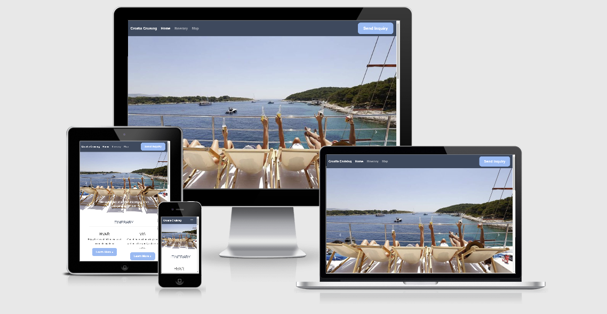
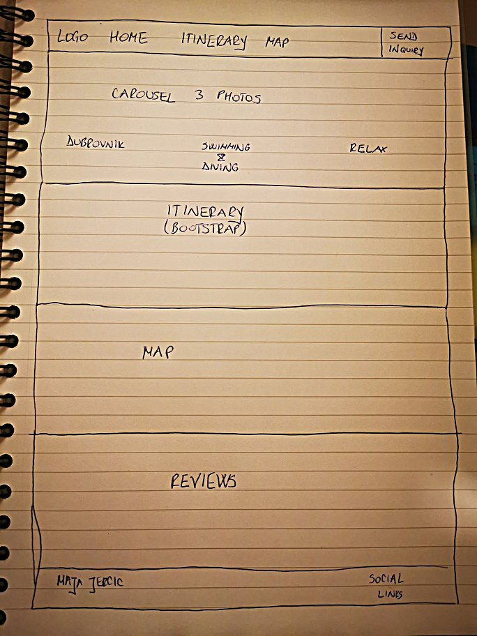

# Milestone Project 2 - Croatia Cruising

## **1. PURPOSE**

The purpose o the project is to showcase the learning from the Full Stack Developer Course, specifically Javasript Fundamentals and Interactive frontend Development, by building a custom mobile-fist fully responsive webpage called "Croatia Cruising".

The primary target audience are potential guests who are interested in booking a cruise holiday along the Croatian coast, people looking for a bit of a different holiday from just lying on beach.

### **2. FUNCTIONALITY OF THE PROJECT**

This project is built usingHTML, CSS and Javascript in order to make individula features work properly. Bootstrap was also used to make sure the page was as responsive as possible to be used on a variety on devices like, tablet, various mobile phones and laptops.
The font used is Roboto and was imported from [Google Fonts](https://fonts.google.com/specimen/Roboto).

### 2.1 GITHUB REPOSITORY AND DEPLOYED PAGE

* [Deployed page](https://maja-jer.github.io/croatia-cruising/)
* [Github repositoiry](https://github.com/Maja-Jer/croatia-cruising)

#### 2.1. TECHNOLOGIES USED

* HTML
* CSS
* Javascript
* jQuery
* Bootstrap
* AutoPrefixer
* GoogleMaps API
* Email JS
* [HTML validator](https://validator.w3.org/)
* [Am I responsive website](http://ami.responsivedesign.is/)

### 2.2 FEATURES

* [Color scheme](https://www.color-hex.com/color-palette/60880) I found this scheme to work best with the theme of the page
* [Grids](https://getbootstrap.com/) I wanted to use Bootstrap to make sure the responsiveness of the page is on the necessary level and also to make sure the navigation of the page is on par as well
* I didn't use a wireframe as I got the idea when I was having a converstation with my friend who has a boat very similar to the one showcased on this page. I drew up the sketch on the page in the notebook I had with me during our lunch and decided to follow that sketch with some small adjustments in order of elements.

### 2.3. FEATURES LEFT TO IMPLEMENT

In the future, i'd like to be able to have the the modal close after sending the email.

Also, I'd like to work on the map some more, adding pop ups when a User clicks ona red pin which would give more information about each location.

## **3. USER EXPERIENCE**

### 3.1. Strategy Plane

This page has tourists in minds, that want to try a different holiday, a bit of an adventruous spirit who loves to explore as well as lounge in the sun. They are young, no kids, willing to spend a bit more for a different holiday and have some amazing experiences as well as cool Instagram photos for their followers
### 3.2. Scope Plane

Features necessary would be: list of places to visit, map of the route, some reviews to entice the ones who need some convincing and a send inquiry button that sends an email to the ownwer who can then send  personalised quote to the intersted party.

### 3.3. Structure Plane

Steps that the User will take to go through the page:

1. User comes to the page 
2. User is attracted by the carousel photos
3. Wants to learn more and continues scrolling
4. Finds list of places that the cruise visits, accompanied by the links to a Lonely Planet article about the town (exception: Hvar and Mljet, I provided local links for them)
5. Checks out the map
6. Reads the reviews
7. OPens the socials link to see the company on social media
8. Scrolls back up to confirm they like what they're seeing and sends an inquiry

### 3.4. Skeleton Plane

This is the original structure of the page. I have adjusted it only slightly from this idea as I preferred. I decided to change "Itinerary" to "Sites" last minute as I felt that title would be more natural to what I decided to build. I left different code sections with the name "itinerary" because the change was last minute and I was worried the change would compromoise the code. 

It's a simple one-page website with navigation directing to different sections of the page showed in the Navbar. Also there is a "Send inquiry" button which was built to send an email through Email JS.
* **Navigation** - built with Bootstrap, fully reponsive to mobile-first
* **Send inquiry** button -  built with Email JS 
* **What will you visit?** - built with Bootsrap as well for full responsiveness
* **Map** - built with GoogleMaps API
* **Reviews** - built with Bootstrap for responsiveness
* **Footer** - has links to socials. The links are live and are [directing to a company that provides similar cruises already](https://www.katarina-line.com/). i wasn't inspired by this page to build mine, I found their page later when I was thinking what social links I should include. 

### 3.5. Surface Plane 

I used the blue color scheme because the page a nautical theme and the color scheme itself is very appealing.
- The font is Roboto, it's clean, easy to read.
- **Navbar** is responsive, adapts to the size of the screen and changes into a hamburger menu.
- **Send Inquiry** button fades out if you hover over it. When you click on it, a **modal** shows in which the User can fill the information and send an email.
- I have added photos to the **carousel**. I was struggling to find high-quality and free photos that show the particular vibe that I was going for, so I chose these photos. If I was to buld this page for commercial use, i would make sure to have stock photos that have been paid for and approved for use on websites.
Also, I was having an issue with the color of the font in the carousel, so in some photos the text sems to disapper. aghain, that is something I'd work on more had this been a commercial page
- **Maps** were difficult to render, but I managed to get them loading correctly.
- The photos in **Reviews** are a bit distorted and whatever I tried to fix it, didn't work unfortunately.
- **Footer** contains social links to a company that provide similar cruises in Croatia.  

## **4. TESTING**

The page was tested across multiple devices (iPhone 7, Huawei P30 Pro, Huawei P30 Lite, Samsung S9, MacbookAir, MacbookPro, ChromeBox, Windows laptops), operating systems (Android, Chrome OS, iOS, Windows 10) and browsers (Chrome 80.0.3987.106, Safari 13.0.3 (15608.3.10.1.4), Mozilla 73.0.1)
As I was committing to git hub, I was checking resposnsiveness in Dev Tools and across devices and updating my code as I was noticing errors.
I was alo making sure that I stick to the original plan as much as possible since in my opinion that structure works best for such a type of page.

## **5. DEPLOYMENT**

### 5.1. DEPLOYING FROM GITHUB

1. Log onto Github
2. Select the respository you want to deploy
3. On the repository page, click on "Settings" and scroll down to "Github Pages"
4. From the "Source" dropdown select "Master Branch" and click "Save"
5. The message "Your site is ready to be published at https://username.github.io/Repository Name/" will appear under Github Pages
6. When you click on this link your webpage will open in a browser window
7. If you receive a 404 error, wait a few minutes and try again. It usually takes a few minutes to deploy
8. Once your website launches you will need to retest it (see Testing section) to ensure that it can still find all the resources (css file, images, etc)

### 5.2. CLONING FROM GITHUB

1. Follow this link to my [Project Repository on Github](https://github.com/Maja-Jer/croatia-cruising)
2. On the repository page click "Clone or Download"
3. In the Clone with HTTPs section, copy the clone URL for the repository.
4. In your local IDE open Git Bash.
5. Change the current working directory to the location where you want the cloned directory to be made.
6. Type git clone, and then paste the URL you copied in Step 3 - "git clone https://github.com/Maja-Jer/croatia-cruising"
7. Press enter and your local clone will be created.

## **6. CREDITS**

### 6.1 CONTENT

#### 6.1.1. PHOTOS

* [Go Sail Croatia](https://gocroatiasail.com/)
* [Dubrovnik](https://www.earthtrekkers.com/11-must-have-experiences-dubrovnik-croatia/)

#### 6.1.2. CODE
* I have used snippets from the CV project (footer), Whiskey Project (navbar)
* I have commented where I have used code from elsewhere. That code has been adapted to my purposes, never copied blindly
* I have copied and adapted the Navbar from my MS1 project

### 6.2 ACKNOWLEDGEMENTS

* **Code Institute**
* fellow Students, mentors, tutors on Slack

#### 6.1. SPECIAL SHOUT OUTS

* **Anna Greaves** (for doing your best to help me undestand why my maps refused to load), **Tim Nelson** (for his help with email and by just being there) and **Samantha_ci** (for deciphering my carousel like a pro) from the Tutor team for their endless patience
* **Simen Daehlin** for taking his time to explain where I was going wrong and helping me learn. Him being Yoda :)
* **Anthony O'Brien** for listening to my rants and helping out when Bootstrap decides to be my biggest enemy :)
* my **Cork_community** on Slack for encouraging me and giving suggestions how to proceed when I got stuck
* To my **fellow students** in Code Institute and to the staff and mentors who use Slack regularly with their own questions/ideas and opinions, helping me with mine, to help me better understand this course

*Disclaimer: This project was created for educational use only as part of the Code Institute Full Stack Software Development Course for Milestone 2 Grading!*

